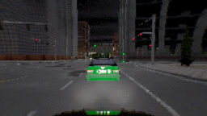
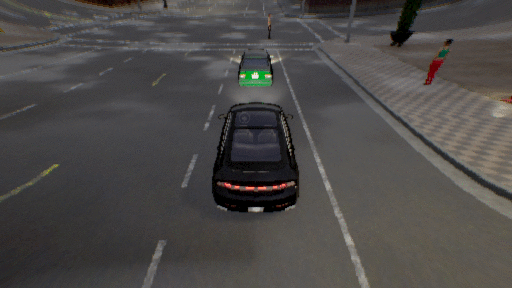
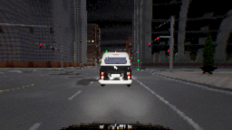
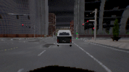
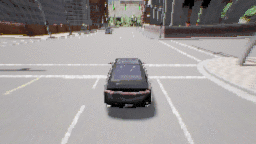
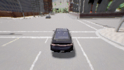

# Introduction
This repo consists of code accompanying "Learning-Based Grammar Fuzzing for Autonomous Vehicles". AutoCop is a grammar-based input fuzzing tool for end-to-end self-driving car controllers. It analyzes CARLA simulator and SVL simulator specifications to generate semantically and temporally valid test scenario with support of multiple search methods for both simulators, respectively.

# Requirements
* OS: Ubuntu 18.04, Ubuntu 20.04
* CPU: at least 8 cores
* GPU: at least 8GB memory
* Carla 0.9.9.4 (for installation details, see below)
* SVL 2021.2
* Apollo 6.0

# Directory Structure
```
~(home folder)
├── Documents
│   ├── self-driving-cars (created by the user manually)
│   │   ├── AutoCop
│   │   ├── carla_0994_no_rss
```
Note: one can create link for these folders at these paths if one cannot put them in these paths.


# CARLA + LBC controller / pid controllers
## Found Traffic Violation Demos

pid-1 controller collides with a pedestrian:
<!-- pid-1 controller collides with a pedestrian: -->
<!--  -->


pid-2 controller collides with the stopped leading car:
<!-- pid-2 controller collides with the stopped leading car: -->
<!--  -->


lbc controller is going wrong lane:
<!-- lbc controller is going wrong lane: -->
<!--
 -->


## Demonstration of Uniqueness Definition for Traffic Violation
### A Found Traffic Violation


### A Highly Similar One


### A Distinct One


## Setup
### Cloning this Repository

Clone this repo with all its submodules

```
git clone https://github.com/autofuzz2020/AutoCop --recursive
```

### Create Conda Environment and Install Python Packages
All python packages used are specified in `environment.yml`.

With conda installed, create the conda environment and install python packages used:
```
conda env create -f environment.yml
```
A conda environment with name `py385` should be created.

Activate this environment by running:
```
conda activate py385
```


### Installation of Carla 0.9.9.4
This code uses CARLA 0.9.9.4. You will need to first install CARLA 0.9.9.4, along with the additional maps.
See [link](https://github.com/carla-simulator/carla/releases/tag/0.9.9) for more instructions.

For convenience, the following commands can be used to install carla 0.9.9.4.

Download CARLA_0.9.9.4.tar.gz and AdditionalMaps_0.9.9.4.tar.gz from [link](https://github.com/carla-simulator/carla/releases/tag/0.9.9), put it at the same level of this repo, and run
```
mkdir carla_0994_no_rss
tar -xvzf CARLA_0.9.9.4.tar.gz -C carla_0994_no_rss
```
move `AdditionalMaps_0.9.9.4.tar.gz` to `carla_0994_no_rss/Import/` and in the folder `carla_0994_no_rss/` run:
```
./ImportAssets.sh
```
Then, run
```
cd carla_0994_no_rss/PythonAPI/carla/dist
easy_install carla-0.9.9-py3.7-linux-x86_64.egg
```
Test the installation by running
```
cd ../../..
./CarlaUE4.sh -quality-level=Epic -world-port=2000 -resx=800 -resy=600 -opengl
```
A window should pop up.

### Download a LBC pretrained model
LBC model is one of the models supported to be tested. A pretrained-model's checkpoint can be found at LBC author's provided [Wandb project](https://app.wandb.ai/bradyz/2020_carla_challenge_lbc).

Navigate to one of the runs, like https://app.wandb.ai/bradyz/2020_carla_challenge_lbc/runs/command_coefficient=0.01_sample_by=even_stage2/files

Go to the "files" tab, and download the model weights, named "epoch=24.ckpt". Move this model's checkpoint to the `models` folder (May need to create `models` folder under this repo's folder).


## Run Fuzzing
```
python ga_fuzzing.py -p 2015 -s 8791 -d 8792 --n_gen 6 --pop_size 50 -r 'town05_right_0' -c 'leading_car_braking_town05_fixed_npc_num' --algorithm_name nsga2-un --has_run_num 300 --objective_weights -1 1 1 0 0 0 0 0 0 0 --check_unique_coeff 0 0.2 0.5
```
For more API information, checkout the interface inside `ga_fuzzing.py`.


python ga_fuzzing.py -p 2015 -s 8791 -d 8792 --n_gen 2 --pop_size 2 -r 'town05_right_0' -c 'leading_car_braking_town05_fixed_npc_num' --algorithm_name nsga2-un --has_run_num 4 --objective_weights -1 1 1 0 0 0 0 0 0 0 --check_unique_coeff 0 0.2 0.5


## Check out maps and find coordinates
Check out the map coordinates by running
```
./CarlaUE4.sh -quality-level=Epic -world-port=2000 -resx=800 -resy=600 -opengl
```
in one's carla's folder to spin the carla server and then running
```
python carla_specific_utils/print_spectactor_coord.py --map Town05
```
in a separate window. Also see the corresponding birdview layout [here](https://carla.readthedocs.io/en/latest/core_map/) for direction and traffic lights information. Note to switch town map, one can change the parameter --map.


## Retrain model from scratch
Note: the retraining code only supports single-GPU training.
Download dataset [here](https://drive.google.com/file/d/1dwt9_EvXB1a6ihlMVMyYx0Bw0mN27SLy/view). Add the extra data got from fuzzing into the folder of the dataset and then run stage 1 and stage 2.

Stage 1 (~24 hrs on 2080Ti):
```
CUDA_VISIBLE_DEVICES=0 python carla_project/src/map_model.py --dataset_dir path/to/data
```

Stage 2 (~36 hrs on 2080Ti):
```
CUDA_VISIBLE_DEVICES=0 python carla_project/src/image_model.py --dataset_dir path/to/data --teacher_path path/to/model/from/stage1
```

## Model Fixing
### Rerun Found Bugs
```
CUDA_VISIBLE_DEVICES=0 python rerun_and_data_analysis/rerun_scenario.py --parent_folder path/to/data/for/finetuning
```

### Finetuning
Stage 2 finetuning:
```
CUDA_VISIBLE_DEVICES=0 python carla_project/src/image_model.py --dataset_dir path/to/data --teacher_path path/to/model/from/stage1
```

### Test Fixed Model
In `carla_specific_utils/carla_specific.py`, set the path `arguments.agent_config` under the condition `elif ego_car_model == 'lbc_augment'` to be that of the newly fine-tuned model.
```
CUDA_VISIBLE_DEVICES=0 python rerun_and_data_analysis/rerun_scenario.py --parent_folder path/to/data/for/finetuning --rerun_mode test --ego_car_model lbc_augment
```


# SVL + Apollo
## Setup
Install SVL2021.2 and Apollo 6.0 following [the documentation of Running latest Apollo with SVL Simulator](https://www.svlsimulator.com/docs/system-under-test/apollo-master-instructions/).

## Create Apollo 6.0 in Vehicles
SVL does not have a default "Apollo 6.0" for "Lincoln2017MKZ" under "Vehicles". To create one, one can duplicate "Apollo 5.0" and then add sensors "Clock Sensor" and "Signal Sensor" from "Apollo 6.0 (modular testing)".

## Run Fuzzing
Need to change `model_id` in svl_specific to one's own model_id on svl web UI.

Start Apollo and SVL API only respectively. Then in a separate terminal:
```
python ga_fuzzing.py --simulator svl --n_gen 10 --pop_size 50 --algorithm_name nsga2-un --has_run_num 500 --objective_weights -1 1 1 0 0 0 0 0 0 0 --check_unique_coeff 0 0.1 0.5 --episode_max_time 30 --ego_car_model apollo_6_with_signal --record_every_n_step 1
```


# Reference
This repo is partially built on top of [Carla Challenge (with LBC supported)](https://github.com/bradyz/2020_CARLA_challenge) and [pymoo](https://github.com/msu-coinlab/pymoo)
